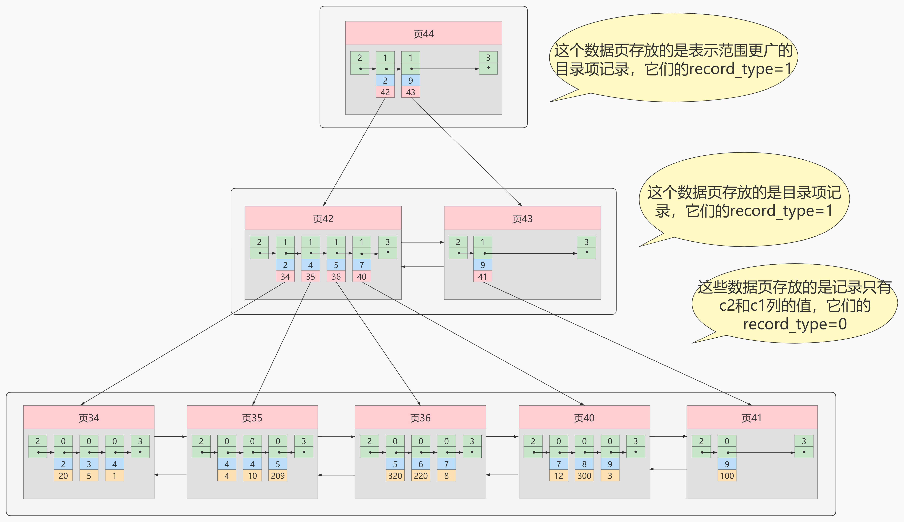
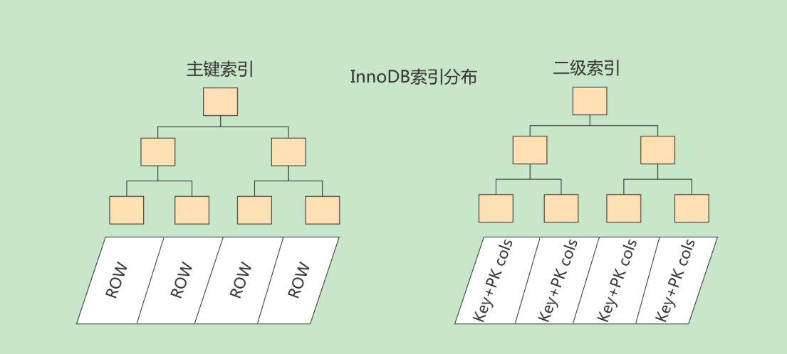
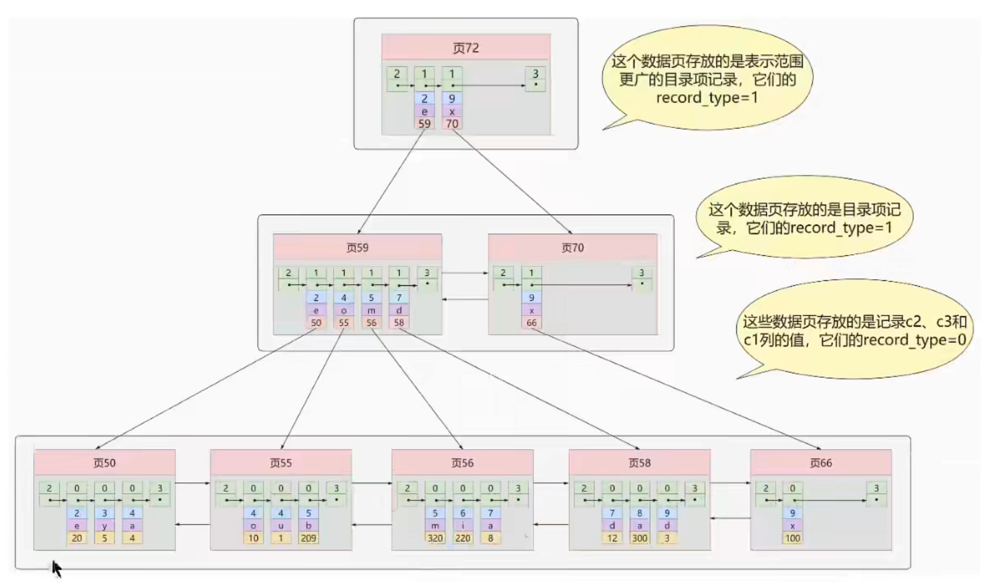

## 1 什么是索引

**MySQL官方对索引的定义为：**索引（Index）是帮助MySQL高效获取数据的数据结构。

索引的本质：索引是数据结构。你可以简单理解为“排好序的快速查找数据结构”，满足特定查找算法。这些数据结构以某种方式指向数据，这样就可以在这些数据结构的基础上实现高级查找算法，索引的作用就相当于目录的作用。打个比方: 我们在查字典的时候，如果没有目录，那我们就只能一页一页的去找我们需要查的那个字，速度很慢。如果有目录了，我们只需要先去目录里查找字的位置，然后直接翻到那一页就行了。

## 2 索引的优缺

### 优点

（1）类似大学图书馆建书目索引，提高数据检索的效率，降低数据库的IO成本，这也是创建索引最主要的原因。
（2）通过创建唯一索引，可以保证数据库表中每一行数据的唯一性。
（3）在实现数据的参考完整性方面，可以加速表和表之间的连接。换句话说，对于有依赖关系的子表和父表联合查询时，可以提高查询速度。
（4）在使用分组和排序子句进行数据查询时，可以显著减少查询中分组和排序的时间，降低了CPU的消耗

### 缺点

加索引也有许多不利的方面，主要表现在如下几个方面：
（1）创建索引和维护索引要耗费时间，并且随着数据量的增加，所耗费的时间也会增加。
（2）索引需要占磁盘空间，除了数据表占数据空间之外，每一个索引还要占一定的物理空间，存储在磁盘上，如果有大量的索引，索引文件就可能比数据文件更     快达到最大文件尺寸。

因此，选择使用索引时，需要综合考虑索引的优点和缺点。
提示： 在 突发 插入频繁的情况下，由于索引可以提高查询的速度，但是会影响插入记录的速度。这
种情况下，可以先先删除表中的索引，然后插入数据，插入完成后再创建索引。

## 3 常见索引概念

索引按照物理实现方式，索引可以分为2种：聚簇（聚集）和非聚簇（非聚集）索引。我们也把非聚集索引称为二级索引或者辅助索引。

### 聚簇索引

在 Mysql 中，InnoDB 引擎的表的 `.ibd`文件就包含了该表的索引和数据，对于 InnoDB 引擎表来说，该表的索引(B+树)的每个非叶子节点存储索引，叶子节点存储索引和索引对应的数据。所有的用户数据记录都存在了叶子节点，数据即索引，索引即数据，**一个表中只能有且只有有一个聚簇索引**

**特点：**

使用记录主键值的大小进行记录和页的排序，这包括三个方面的含义：

- 页内的记录是按照主键的大小顺序排成一个单向链表。
- 各个存放用户记录的页也是根据页中用户记录的主键大小顺序排成一个双向链表。
- 存放目录项记录的页分为不同的层次，在同一层次中的页也是根据页中目录项记录的主键大小顺序排成一个双向链表。

B+树的叶子节点存储的是完整的用户记录。
所谓完整的用户记录，就是指这个记录中存储了所有列的值（包括隐藏列）

**优点：**

- 数据访问更快，因为聚簇索引将索引和数据保存在同一个B+树中，因此从聚簇索引中获取数据比非聚簇索引更快
- 聚簇索引对于主键的排序查找和范围查找速度非常快
- 按照聚簇索引排列顺序，查询显示一定范围数据的时候，由于数据都是紧密相连，数据库不用从多个数据块中提取数据，所以节省了大量的io操作

**缺点：**

- 插入速度严重依赖于插入顺序，按照主键的顺序插入是最快的方式，否则将会出现页分裂，严重影响性能。因此，对于InnoDB表，我们一般都会定义一个自增的ID列为主键
- 更新主键的代价很高，因为将会导致被更新的行移动。因此，对于InnoDB表，我们一般定义主键为不可更新
- 二级索引访问需要两次索引查找，第一次找到主键值，第二次根据主键值找到行数据

**主键索引属于聚集索引。**

聚簇索引的表现形式：

（1）如果表定义了主键，则主键就是聚集索引；

（2）如果表没有定义主键，则第一个唯一非空索引列是聚簇索引；

（3）如果以上两种都不存在，InnoDB会创建一个隐藏的row-id作为聚簇索引；

### 二级索引（辅助索引、非聚簇索引）

**非簇集索引即索引结构和数据分开存放的索引**




**概念：**回表 我们根据这个以c2列大小排序的B+树只能确定我们要查找记录的主键值，所以如果我们想根据c2列的值查找到完整的用户记录的话，仍然需要到 聚簇索引 中再查一遍，这个过程称为 回表 。也就是根据c2列的值查询一条完整的用户记录需要使用到 2 棵B+树！

**非聚集索引不一定回表查询**

> 试想一种情况，用户准备使用 SQL 查询用户名，而用户名字段正好建立了索引。

```mysql
SELECT name FROM table WHERE name='张飞';
```

**问题：为什么我们还需要一次 回表 操作呢？直接把完整的用户记录放到叶子节点不OK吗？**

重复的存储数据，没有必要，假如一个表就占用1GB，那个每建立一个索引就要多出来1GB；



###  联合索引

我们也可以同时以多个列的大小作为排序规则，也就是同时为多个列建立索引，比方说我们想让B+树按照 c2和c3列 的大小进行排序，这个包含两层含义：

- 先把各个记录和页按照c2列进行排序。
- 在记录的c2列相同的情况下，采用c3列进行排序

注意一点，以c2和c3列的大小为排序规则建立的B+树称为 联合索引 ，本质上也是一个二级索引。它的意思与分别为c2和c3列分别建立索引的表述是不同的，不同点如下：

- 建立 联合索引 只会建立如上图一样的1棵B+树。
- 为c2和c3列分别建立索引会分别以c2和c3列的大小为排序规则建立2棵B+树。

